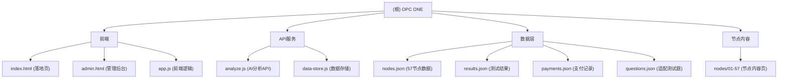

# OPC节点百科3.0

> 让一个人公司创业变得简单。

## 项目愿景

OPC节点百科 — 纯OPC（一人公司）创业从0到1的完整节点导航系统。包含57个创业节点，覆盖想法→工具→开发→注册→支付→上线→赚钱的完整路径。

**核心原则**：
- 绝对纯OPC：删除所有需要员工、合伙人、融资的内容
- 生死线前置：所有能导致项目死亡的节点放在最前面
- 严格线性：按照"想法→工具→开发→注册→支付→上线→赚钱"顺序排列

## 架构总览



## 模块索引

| 模块 | 路径 | 职责 | 入口/接口 |
|------|------|------|----------|
| 前端展示层 | `/` | 落地页、节点导航、OPC适配测试 | `index.html` |
| 管理后台 | `/admin.html` | 测试结果统计、付款管理 | `admin.html` |
| API服务 | `/api/` | AI分析、数据存储 | `api/analyze.js` |
| 节点内容 | `/nodes/` | 57个创业节点详情页 | `nodes/{id}-{slug}/index.html` |
| 数据存储 | `/data/` | JSON文件持久化 | `data-store.js` |

## 57个节点体系（8个阶段）

| 阶段 | 数量 | 说明 |
|:---|:---|:---|
| 产品验证与准备 | 6个 | 想法筛选，原型设计，MVP定义 |
| 环境搭建与Hello World | 4个 | 开发环境，Git版本控制，后端连接 |
| 核心功能开发 | 7个 | 认证系统，三大核心功能，支付集成 |
| 测试与修复 | 4个 | 自测流程，灰度测试，Bug修复，性能优化 |
| 上线准备 | 6个 | 内容填充，公司注册，域名ICP，网站部署 |
| 正式上线 | 3个 | 提交审核，审核问题处理，正式发布 |
| 上线后迭代与运营 | 13个 | 数据分析，冷启动，内容营销，定价策略 |
| 并行支撑层 | 14个 | 银行税务，企业邮箱，商标版权，安全合规 |

## 运行与开发

```bash
# 安装依赖
npm install

# 启动服务
bash start.sh

# 访问
# - 测试页面: http://localhost:3000
# - 管理后台: http://localhost:3000/admin.html
# - API服务: http://localhost:3001
```

**环境变量** (`api/.env`):
- `OPENAI_API_KEY` / `DEEPSEEK_API_KEY` - AI模型API密钥
- `TOKEN_HUB_APP_ID` / `TOKEN_HUB_API_KEY` - 腾讯TokenHub配置

## 测试策略

- 人工测试流程：每个节点完成后进行自测
- 灰度测试：分阶段部署验证
- AI分析：DeepSeek V4 Flash提供节点建议

## 编码规范

- 前端: Vanilla JS + Tailwind CDN
- 后端: Node.js + Express (CommonJS)
- 样式: CSS变量系统 (#111110 深色主题, #C0392B 强调色)
- 数据: JSON文件持久化，无数据库

## AI使用指引

- 节点内容生成：使用AI分析创业节点适合性
- 适配测试：10题问卷评估OPC适合度
- 建议路径：基于测试结果推荐学习顺序

## 节点内容库（57个节点详情）

已扫描56个节点（除01-opc-fit-test外）：

| 节点 | 标题 | TOC | 交互 |
|:---|:---|:---:|:---:|
| 02 | 个人能力与资源盘点 | - | - |
| 03 | 问题定义与用户调研 | 13 | - |
| 04 | 产品原型设计 | - | - |
| 05 | MVP功能清单 | - | - |
| 06 | 技术选型（零基础专属） | 14 | - |
| 07 | 开发环境安装 | - | - |
| 08 | Hello World 启动 | - | - |
| 09 | Git版本控制初始化 | - | - |
| 10 | 后端CRUD连接测试 | - | - |
| 11 | 用户认证系统 | - | - |
| 12 | 核心功能1开发 | - | - |
| 13 | 核心功能2开发 | - | - |
| 14 | 数据展示与交互 | - | - |
| 15 | 核心功能3开发 | - | - |
| 16 | 支付代码集成 | - | - |
| 17 | 国内支付接入 | - | - |
| 18 | 开发者自测流程 | - | - |
| 19 | 亲友灰度测试 | - | - |
| 20 | Bug集中修复 | - | - |
| 21 | 性能基础优化 | - | - |
| 22 | 上线内容填充 | - | - |
| 23 | 公司注册与主体选择 | 12 | - |
| 24 | 域名购买与ICP备案 | - | - |
| 25 | 网站部署与SSL | - | - |
| 26 | 审核材料准备 | - | - |
| 27 | 上线前检查清单 | - | - |
| 28 | 提交审核与等待 | - | - |
| 29 | 审核问题处理 | - | - |
| 30 | 正式发布 | - | - |
| 31 | 数据监控 | 11 | - |
| 32 | 冷启动获客 | - | - |
| 33 | 内容营销与SEO/ASO | - | - |
| 34 | 用户反馈收集 | - | - |
| 35 | 社群与私域运营 | - | - |
| 36 | AI客户服务 | - | - |
| 37 | 客户异议应对 | - | - |
| 38 | 定价策略 | - | - |
| 39 | 广告投放 | - | - |
| 40 | 用户转介绍机制 | - | - |
| 41 | 每周迭代与复盘 | - | - |
| 42 | 收入多元化 | - | - |
| 43 | 产品规模化决策 | - | - |
| 44 | 银行开户与商户号 | - | - |
| 45 | 税务报到与筹划 | 13 | - |
| 46 | 现金流与财务基础 | 16 | ✓ |
| 47 | 企业邮箱搭建 | - | - |
| 48 | 商标申请 | - | - |
| 49 | 软件著作权登记 | - | - |
| 50 | 广告合规 | - | - |
| 51 | 数据备份与恢复 | - | - |
| 52 | 服务器安全防护 | - | - |
| 53 | 海外支付方案 | - | - |
| 54 | 微信小程序部署 | - | - |
| 55 | 外包策略与执行 | - | - |
| 56 | 精力与能量管理 | - | - |
| 57 | 政府政策与创业补贴 | - | - |

**节点内容特点**：
- 仅5个节点有目录导航（TOC）：03、06、23、31、45、46
- 仅1个节点有交互组件（计算器/表单）：46-现金流
- 其余52个节点为纯内容页面

## 变更记录 (Changelog)

### 2026-05-10 12:30
- 初始化AI上下文，生成根级CLAUDE.md（含Mermaid模块图）
- 完成全仓扫描：前端+API+数据+节点内容
- 识别模块：index.html, admin.html, api/analyze.js, data-store.js, nodes.json, questions.json

### 2026-05-10 12:35
- 批量扫描56个节点内容页
- 发现：仅5个节点有TOC导航，仅1个节点(46现金流)有交互计算器
- 更新CLAUDE.md节点内容库表格

### 2026-05-10 12:45
- 节点31（数据监控）第一屏UI更新：大标题改为 `clamp(48px, 10vw, 96px)`，添加hero-label和间距变量
- 节点31已同步到生产服务器

## 设计规范 (Design System)

### 哲学基础

**Ma（間）**：意义存在于事物*之间*的空间，空白不是缺失而是存在。
**侘寂（わびさび）**：不完美、无常、不完整中的美。
**余白（よはく）**：慷慨边距的艺术，内容是海洋中的孤岛。

### 禁止事项（Anti-Patterns）
- ❌ 对称3列卡片网格
- ❌ 原色CTA（蓝色按钮、绿色横幅）
- ❌ 圆角药丸按钮（`border-radius: 0` 或最大 `2px`）
- ❌ 可见色调的投影
- ❌ 弹跳/弹簧动画
- ❌ 粗描边图标（仅用 `stroke-width: 1` 的超细图标）
- ❌ 低于32px的网格间距
- ❌ 网络安全字体（Arial, Helvetica, Roboto, Inter）
- ❌ Emoji、装饰性插图包或剪贴画

### 强制要求
- ✅ 大量余白（区段间最小 `--space-3xl: 96px`）
- ✅ 不对称布局，"不平衡"即设计本身
- ✅ 阅读段落 `max-width: 44ch`（约58字符）
- ✅ 至少一个超大元素（`clamp(48px, 10vw, 96px)` 标题）
- ✅ 排版作为主要视觉元素
- ✅ **页面最大宽度 1200px**（所有节点页面统一）
- ✅ **页面自适应**（响应式布局，使用 `clamp()` 函数）

### 色彩系统

**亮色模式（和纸）**：
- 背景: `#F8F5F0`
- 表面: `#FFFFFF` 或 `#FAFAF8`
- 主要文字: `#1A1A18`
- 次要文字: `#6B6862`
- 三级/时间戳: `#A8A49E`
- 强调色（朱红）: `#C0392B`

**暗色模式（墨色）**：
- 背景: `#111110`
- 表面: `#1A1A18`
- 主要文字: `#F0EDE6`
- 次要文字: `#7A7670` 或 `#B8B4AE`
- 三级/时间戳: `#4A4744` 或 `#A8A49E`
- 强调色（朱红暗色）: `#E05A47` 或 `#C0392B`
- 结构线: `#2A2A28`

### 排版系统

**字体层级**：
- 标题: `'Noto Serif JP'`（明朝体，毛笔影响）
- 正文/UI: `'Noto Sans SC'`（哥特体，干净）
- 日文强调: `'Shippori Mincho'` + `'Noto Sans JP'`

**字号比例**：
```
Hero标题: clamp(48px, 10vw, 96px) / line-height: 0.95
Section标题: clamp(1.125rem, 2.5vw, 1.375rem)
正文: 16px / line-height: 1.8
辅助文字: 13px
标注/标签: 12px
```

**字间距规则**：
- 标题: `letter-spacing: -0.03em`
- 正文（CJK）: `letter-spacing: 0.04em`
- 标签/导航: `letter-spacing: 0.15em`

### 间距系统（8px倍数）

```css
--space-xs: 8px
--space-sm: 16px
--space-md: 24px
--space-lg: 32px
--space-xl: 48px
--space-2xl: 64px
--space-3xl: 96px
--space-4xl: 128px
```

### 组件规格

**导航栏**：
```css
/* 固定顶部导航 */
.fixed-top-nav {
  position: fixed;
  top: 0;
  left: 0;
  right: 0;
  z-index: 100;
  display: flex;
  justify-content: space-between;
  align-items: center;
  padding: 0.875rem clamp(1.25rem, 4vw, 2.5rem);
  background: rgba(17, 17, 16, 0.85);
  backdrop-filter: blur(12px);
  border-bottom: 1px solid var(--line);
}
```

**Hero区**：
```html
<div class="hero" style="padding: var(--space-4xl) 0 var(--space-3xl);">
  <div class="hero-label">节点 XX · 核心必做</div>
  <h1 style="font-size: clamp(48px, 10vw, 96px);">标题</h1>
  <p class="lead">描述文字</p>
</div>
```

**按钮/CTA**：
```html
<a class="inline-flex items-center gap-3 text-sm tracking-[0.08em] 
  uppercase border-b border-current pb-0.5 hover:opacity-60 
  transition-opacity duration-300">
  查看项目
  <span class="text-[10px]">→</span>
</a>
```
无填充按钮形状，行动通过排版说话。

**卡片**：
```css
.card {
  background: var(--surface);
  border: 1px solid var(--line);
  padding: var(--space-lg);
  /* 无圆角或 max 2px */
}
```

**分隔线**：
```html
<hr class="border-0 border-t border-[#2A2A28] my-16">
```

### 动效原则（無——无动效）

- **时长**: 最少 `400ms`，偏好 `600ms–800ms`
- **缓动**: `cubic-bezier(0.25, 0.46, 0.45, 0.94)`
- **入场**: 仅 `opacity-0 translateY(20px)` → `opacity-1 translateY(0)`
- **出场**: 仅淡出到 `opacity-0`
- **悬停**: 仅透明度偏移 `transition-opacity duration-300`

### 布局模式

**侧边栏TOC布局**（用于有目录的节点）：
```css
.layout {
  display: grid;
  grid-template-columns: 220px minmax(0, 1fr);
  gap: clamp(2rem, 4vw, 3rem);
  max-width: 1200px;        /* 固定最大宽度 */
  margin: 0 auto;
  padding: 5rem clamp(1.25rem, 5vw, 3rem) 2rem;
}
```

**全宽Hero布局**（用于简单节点）：
```css
.page {
  max-width: 1200px;        /* 固定最大宽度 */
  margin: 0 auto;
  padding: 0 clamp(24px, 8vw, 120px);  /* 响应式自适应 */
}
```

**关键约束**：
- 所有节点页面 `.page` 或 `.layout` 的 `max-width` 统一为 **1200px**
- 内边距使用 `clamp()` 实现响应式自适应
- 内容区段间距至少 96px（`--space-3xl`）

### 节点样式更新检查清单

当更新节点样式时，确保：
- [ ] h1标题: `clamp(48px, 10vw, 96px)` / `line-height: 0.95`
- [ ] hero-label存在且格式正确（`节点 XX · 核心必做`）
- [ ] 间距变量已添加（`--space-xl`, `--space-3xl` 等）
- [ ] lead段落样式（`max-width: 44ch`, `line-height: 1.8`）
- [ ] 保留侧边栏TOC（如有）
- [ ] 无圆角药丸按钮
- [ ] 无弹簧动画
- [ ] 朱红强调色每页最多1处
- [ ] **页面最大宽度 1200px**
- [ ] **响应式自适应（使用 clamp() 函数）**

### 标记符号系统

**禁止使用 Emoji**，使用优雅的 Unicode 符号替代：

```html
<!-- 正确：使用 Unicode 符号 -->
<span class="mark-check">✓</span>
<span class="mark-cross">×</span>
<span class="mark-warn">⚠</span>
<span class="mark-build">◈</span>

<!-- 错误：使用 Emoji -->
❌ ✓ 🚧 ⚠️ ✅
```

**Unicode 符号规范**：
- `×` — 错误、否定（朱红色）
- `✓` — 正确、肯定（绿色）
- `⚠` — 警告、注意（朱红色，稀缺使用）
- `◈` — 建设中进行（灰色）

**符号颜色 CSS**：
```css
.mark-check { color: #4CAF50; font-weight: 600; }
.mark-cross { color: #C0392B; font-weight: 600; }
.mark-warn { color: #C0392B; }
.mark-build { color: #A8A49E; }
```

**替换对照表**：
| Emoji | Unicode | 用途 |
|:---|:---|:---|
| ❌ ✕ | `×` | 错误、否定 |
| ✓ ✅ | `✓` | 正确、肯定 |
| ⚠️ | `⚠` | 警告、注意（少用） |
| 🚧 | `◈` | 建设中 |